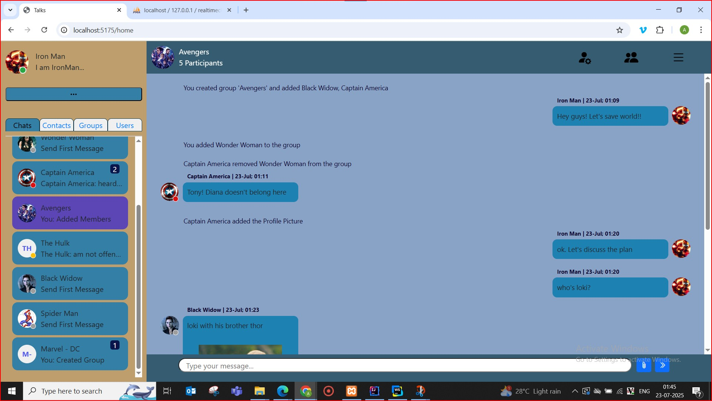

# 💬 Real-Time Chat Application

A full-stack real-time chat application built using Spring Boot (Java) and React (JS). It supports private and group messaging, file sharing, and a interactive UI — ideal for learning or demonstrating modern web development skills.

---

## 📑 Table of Contents

- [Introduction](#introduction)
- [Features](#features)
- [Tech Stack](#tech-stack)
- [Prerequisites](#prerequisites)
- [Getting Started](#getting-started)
- [ERD Data Model](#erd-data-model)
- [Walkthrough (with Screenshots)](#walkthrough-with-screenshots)
- [Future Scope](#future-scope)
- [Contribution](#contribution)
- [License](#license)

---

<h2 id="introduction">🧭 Introduction</h2>

This project mimics real-world messaging platforms, inspired from Teams and Skype. It includes:

- User authentication (JWT)
- Real-time private/group chat
- File sharing (via Spring Boot)
- Contact management
- Clean separation between frontend and backend

---

<h2 id="features">✨ Features</h2>

- ✅ Real-time messaging using WebSocket (STOMP)
- ✅ User login/signup via JWT
- ✅ Private and group chat functionality
- ✅ File uploads/downloads
- ✅ Contact management UI
- ✅ Dynamic online status
- ✅ User status ("About Me")
- ✅ Custom nicknames for contacts (for friends and groups)

---

<h2 id="prerequisites">🧰 Tech Stack</h2>

### 🔙 Backend (Spring Boot)

- Spring Web, Spring Security
- Spring Data JPA to communicate with DB
- WebSocket (STOMP protocol)
- JWT (JSON Web Token) based authentication
- MariaDB (via XAMPP)
- Lombok for boilerplate reduction

### 🔛 Frontend (React + Vite)

- React.js with Hooks and Context API
- Fetch for HTTP requests
- WebSocket client for real-time comms
- Bootstrap for styling

### 📂 File Handling

- Spring MVC Multipart support
- Files stored in local disk (customizable via application.properties)

---

<h2 id="">🔧 Prerequisites</h2>

Ensure the following are installed:

- **Java JDK 17+**
- **Node.js v18+** ([Download](https://nodejs.org/))
- **XAMPP with MariaDB** ([Download](https://www.apachefriends.org/index.html))

### ⚙️ Start Apache and MySQL (MariaDB)

1. Launch: `C:\xampp\xampp-control.exe` (or from whichever folder you installed)
2. Start:
   - Apache 🟢
   - MySQL (MariaDB) 🟢

---

<h2 id="getting-started">🚀 Getting Started</h2>

### 🗂️ Setup Folder and Clone

```bash
mkdir ChatProject
cd ChatProject
git clone https://github.com/AnbuGanesanB/RealTimeChatApp.git
cd RealTimeChatApp
```

### 1️⃣ Start Backend

```bash
cd backend
copy src\main\resources\application-sample.properties src\main\resources\application.properties
# IMPORTANT: Once copied, Edit 'application.properties' to update your DB credentials and JWT key(if needed other than provided)
mvn spring-boot:run
```

Ensure Backend server starts at Port:8080.

### 2️⃣ Start Frontend

Open a **new terminal** at 'ChatProject' root folder:

```bash
cd RealTimeChatApp
cd frontend
npm install
npm run dev
```

Ensure Frontend starts at Port:5175.

It is highly advisable to ensure starting on the above said ports for user ease.
Else, Need to make changes in configurations accordingly and start again.

### 3️⃣ Visit the App

Go to: `http://localhost:5175/login`

Note: Please make sure to use the app in full screen with zoom percent-100%

### 🛑 To Stop the App

```bash
# Stop Backend
Ctrl + C in the terminal running Spring Boot

# Stop Frontend
Ctrl + C in the terminal running React/Vite

# Stop DB services (optional)
In XAMPP Control Panel, click "Stop" for Apache and MySQL
```

---

<h2 id="erd-data-model">🛢️ ERD Data Model</h2>


---

<h2 id="walkthrough-with-screenshots">🖼 Walkthrough (with Screenshots)</h2>

### 📋 Contents:

- [Registration Page](#img1)
- [Home Page](#img2)
- [Display Picture Setting](#img3)
- [User "About Me" Status](#img4)
- [Adding Friends](#img5)
- [Private Chat](#img6)
- [Add Group](#img7)
- [Group Chat](#img8)
- [Edit Group](#img9)
- [Custom Nicknames](#img10)
- [File Transfer](#img11)
- [Online Status Selector](#img12)
- [All Contacts](#img13)
- [Only Users](#img14)
- [Only Groups](#img15)
- [Signout](#img16)

---

<h3 id="img1">🔐 Registration Page</h3>


- Users can self-register by providing email, username, and password.
- Displays proper validation and error messages on failure.
- Once Registration successful, User can login into the application

---

<h3 id="img2">🏠 Home Page</h3>


- Home page upon user successful login
- User will notice their own self in contact list. User may use this feature for taking personal notes

---

<h3 id="img3">🖼️ Display Picture Setting</h3>


- 'Three dots' icon on top-left brings user the Profile settings modal.
- Users can upload or update their profile image.
- Image previews and format validations included.
- DP change will be reflected immediately to other friends and in groups in real time.

---

<h3 id="img4">🧑‍💼 User "About Me" Status</h3>


- Custom status that appears on your profile.
- Editable anytime from profile settings.
- Status change will be reflected immediately to other friends and in groups in real time.

---

<h3 id="img5">➕ Adding Friends</h3>


- Search users and add to your contact list.
- Contact will be immediately upon clicking the '+' icon and list will be updated.
- Upon adding contact, the '+' icon will change to '✔' icon.

---

<h3 id="img6">💬 Private Chat</h3>


- One-to-one messaging with selected contacts.
- Messages stored and loaded with history.

---

<h3 id="img7">👥 Add Group</h3>


- Create a new group by clicking on 'Add Group' icon from Nav-bar.
- By selecting contacts and providing valid name, group can be created.
- All the active members then will be updated with new group contact.
- User who creates group is mandaotory member while creating group.
- User can able to add members only if they are available in his/her own contact list.

---

<h3 id="img8">🧵 Group Chat</h3>


- Real-time messaging with multiple users.
- Each group has its own message history.
- Group member change their own profile 'DP/About me' - will be reflected in group also in real time.

---

<h3 id="img9">🛠️ Edit Group</h3>


- Group DP settings only available after group is created.
- Any user can change or remove DP.
- Any user can modify the Group name.
- Any user can Add or remove members even their own self.
- Modifications on Group DP, Group name, active Members will be recorded as a notification inside the group as an update. Same will be reflected among applicable users in Real-time.
- Once user is no longer an active member, they can't listen (or) send messages to group

---

<h3 id="img10">🏷️ Custom Nicknames</h3>

- Set nicknames(contact name) for your contacts (private to you).
- Helpful for personalization.
- Can be set for friends as well as Group.(like we save contacts in our phones).
- Once any contact is selected from home page, this option is available by clicking (Edit contact / Edit Group based on contact) available in Nav-bar.
- If Individual contact, modal will display only the nickname change option.
- If Group, this option will be available inside 'Edit group' modal.
- Only if the Nickname is different from their original name, Nickname will be visible in applicable areas of interface(adjacent to their name in Nav-bar or in Contacts tab).

---

<h3 id="img11">📁 File Transfer</h3>


- Send files in private or group chats.
- Supports PDF, image, docs, xlsx, etc.
- Single file must be 10MB(max.) and group of files total must be 100MB(max).
- Once uploaded, file previews will be displayed with option for remove.
- Once message with files sent, the message will appear on chat-history with files.
- Image files are shown preview in chat-history along with downloadable link.
- Other than image files are shown only the downloadable link with their name.

---

<h3 id="img12">🟢 Online Status Selector</h3>


- Choose your visibility: Online, Busy, Away, or Invisible.
- Will be updated to your contacts in real time. Others see your status in their contact list.
- For now, Once the user logout status will be set as Offline.
- Once login again, status will remain Offline, unless changed intentionally by user.

---

<h3 id="img13">📒 All Contacts</h3>



- Combined list of users and groups added as contacts.
- Shows online status and last activity.

---

<h3 id="img14">👤 Only Users</h3>


- Filtered view showing only user contacts (not groups).
- Contact card will display with nickname you provided.
- Also display their 'About me' status.

---

<h3 id="img15">👥 Only Groups</h3>


- Filtered view showing only group contacts.
- Contact card will display the number of active members.

---

<h3 id="img16">🚪 Signout</h3>


- Clean logout functionality that clears user session and returns to login page.
- Signout is listed under options from 'Menu' icon in Nav-bar.
- Once Signed out, JWT is removed from browser, all hooks and contexts will be set to default with no stale values.
- window will be back to login page.

---

<h2 id="future-scope">🔮 Future Scope</h2>

- End-to-End Encryption (E2EE)
- Audio/Video Calling (via WebRTC)
- Delivery & Read Receipts (✔ / ✔✔ blue tick system)
- Message history sync across sessions/devices
- Deployment: Docker + HTTPS
- Password change, Email change and Forgot Password features
- Responsive UI layout for various display sizes.

---

<h2 id="contribution">🙌 Contribution</h2>

This is a personal project meant for learning and showcasing skills, but feel free to fork and experiment.

---

<h2 id="license">📄 License</h2>

MIT — Free to use for personal and professional demos.
